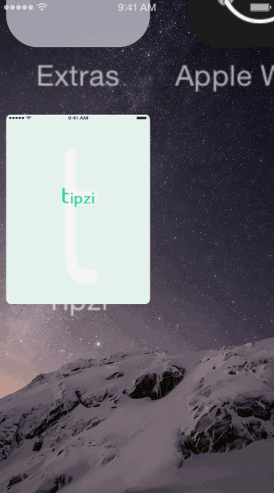

# Tipzi
This is a tip calculator for CodePath iOS Designer Application
Time spent: ~35 hours

Completed user stories:
 Required:
 *[x] User can input the bill amount
 *[x] Tip Calculating
 Optional:
 *[x] Animation when starting the application
 *[x] Split the bill with other people
 *[x] Icon changed when clicked
 *[x] Tip percentage slider
 *[x] Color
 *[x] Font
 *[x] Logo + Launching image
 
Notes:

Spent sometime figuring out how to use the Twitch and Case function, how to change the icon when clicked and the slider calculation

GIF created with [LiceCap](http://www.cockos.com/licecap/).

